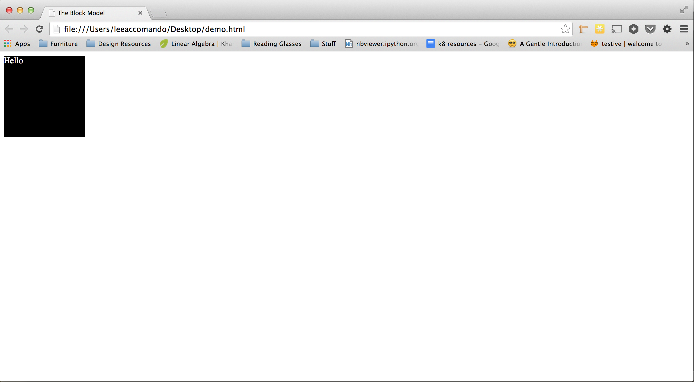
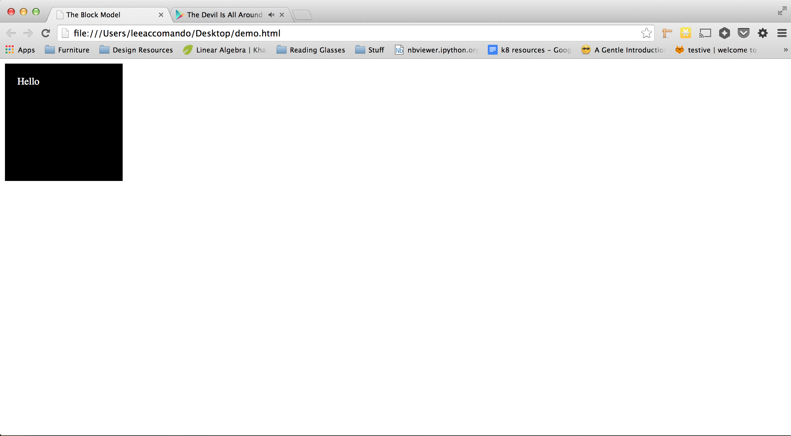
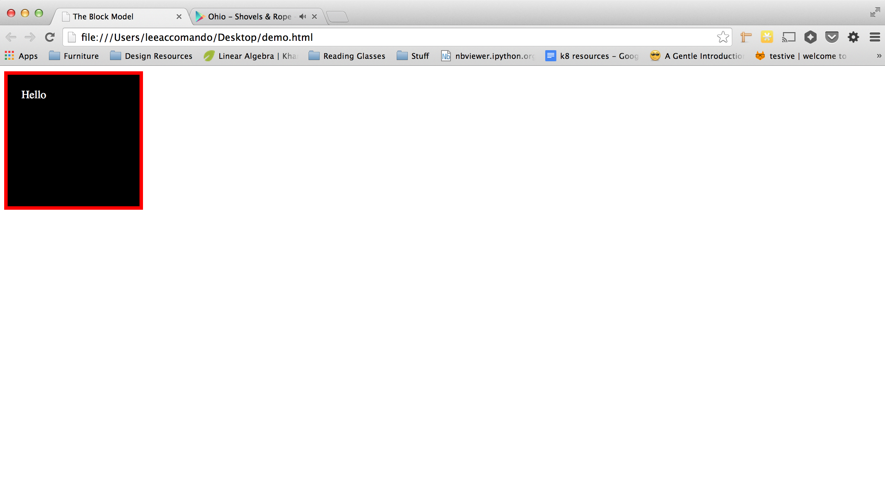
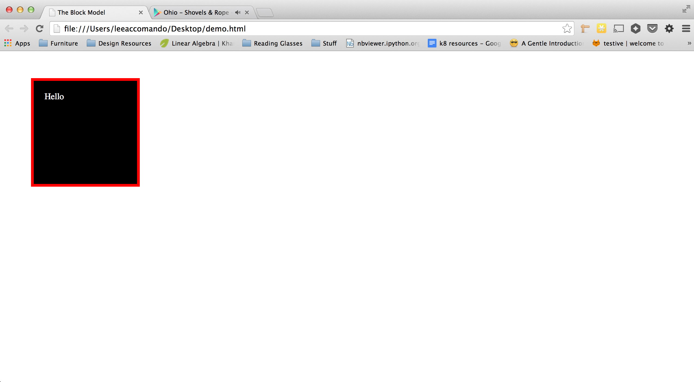

# The Box Model

The browser calculates the width and height of your elements primarly based upon five properties, _width_, _height_, _padding_, _margin_, and _border_. The rules for how these properties interact are referred to as the **box model**. Alright, let's dive right in and see how these properties work.

For the purposes of this example I am going to use the html below (and you should too!)

```html
<html>
	<head>
		<title>The Block Model</title>
	</head>
	<body>
		<div class="block"></div>
	</body>
</html>
```

Now let's define the basic height and width of our div.

```css
.block {
    background-color:#000; /* Just so we can see it */
	height:150px;
	width:150px;
}
```

If you load that up in your browser you should see something like this:


Exactly what we would would expect, a black box with the dimensions we specified. Before we move on, let's add some content to our block, as so:

```html
<div class="block">Hello!</div>
```

And update our CSS so we can read it

```css
.block {
    background-color:#000; /* Just so we can see it */
    color:#fff;
	height:150px;
	width:150px;
}
```

Which should result in:



Now, let's say that instead of having "Hello" be at the very top left of the box, we wanted to give it some breathing room, that is where padding comes in. The padding property controls the amount of space between the content in an element (in this case "Hello") and the edge of the element. To see how it works try updating your CSS as follows:

```css
.block {
    background-color:#000; /* Just so we can see it */
    color:#fff;
	height:150px;
	width:150px;
	padding:20px;
}
```

Resulting in:



Now notice a couple of things here:

1. Our text is moved 20px away from the top and left of the block, just like we wanted!
2. Our box is now 40px taller and 40px wider.

This illustrates the first (kinda confusing) aspect of the box model. _The width and height of your elements are calculated from more than just 'height' and 'width' properties._ Your padding value gets added to the final height and width of your element. So we can calculate the new height and width of our element with the following:

    final width = width property value + (2 * padding value)
    final height = height property value + (2 * padding value

Note that we are multiplying our padding value by 2, because padding is applied on all 4 sides of an element.

Alright, so now imagine we want to add a border to our element. To do so we could update our CSS as follows:

```css
.block {
    background-color:#000; /* Just so we can see it */
    color:#fff;
	height:150px;
	width:150px;
	padding:20px;
	border:5px solid red;
}
```

Resulting in:



Sweet! Now let's talk about some of the big takeaways from this:

1. Our border is placed on the very outer edge of the element (on the outside of our padding)
2. The box got taller / wider again! In this case by 10px.

So now we know that the box model also takes borders into account when calculating widths and heights, so we can update our equations as so:

    final width = width property value + (2 * padding value) + (2 * border value)
    final height = height property value + (2 * padding value) + (2 * border value)

Awesome. But let's say that now we don't want our box to be so close to the top and left of the page, we want some space around it. Well there is one last aspect to the box model, and that is margin. Margin refers to how much space an element has around it (even beyond the border). To check this out you can update your CSS as follows:

```css
.block {
    background-color:#000; /* Just so we can see it */
    color:#fff;
	height:150px;
	width:150px;
	padding:20px;
	border:5px solid red;
	margin:50px;
}
```

Resulting in:



Look at that! Now our box is moved 50px away from the top and left of the page. You can think of margin as the breathing space your elements have from the other elements around them.

Alrighty, so we covered quite a bit of ground with this. Let's summarize the box model.

- The base width and height of an element can be defined using the 'width' and 'height' CSS properties.

- The 'padding' property applies additional width and height to your elements _beyond the content of the element_.

- The 'border' property applies additional width and heigh to your elements _beyond    the padding of the element_.

- The 'margin' property applies space around the element, preventing other elements from getting to close.
